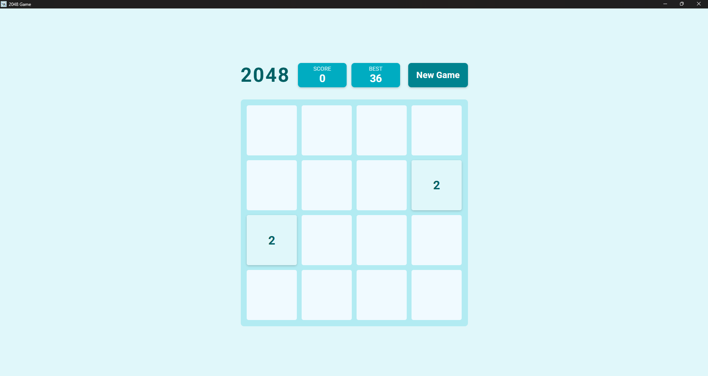

# 🎮 2048 Game

A sleek and responsive desktop version of the classic 2048 puzzle game! (Electron Desktop App) Built using **HTML**, **CSS**, and **JavaScript**, and powered by **Electron.js** ⚡. Developed with assistance from **Cursor AI** 🤖.

---

## 🚀 Features

✨ Classic 2048 puzzle gameplay  
📊 Score & Best Score tracking using `localStorage`  
🔁 New Game button to restart anytime  
📱 Touch-friendly controls for swipe support  
🖥️ Packaged as a standalone Windows desktop app  
🎨 Responsive UI design

---

## 📁 Project Structure

```

2048/
├── dist/                        # 📦 Output folder for packaged app
│   └── 2048Game-win32-x64/     # 🪟 Windows build
├── node\_modules/                # 📚 Dependencies
├── www/                        # 🌐 Frontend UI
│   ├── images/
│   │   ├── 2048.ico            # 🧊 App icon for packaging
│   │   ├── 2048.png            # 🎯 Main icon
│   │   └── screenshot.png      # 📸 Screenshot preview
│   ├── index.html              # 🧩 Game layout
│   ├── script.js               # 🧠 Game logic
│   └── style.css               # 🎨 Game styles
├── main.js                     # ⚙️ Electron main process
├── package.json                # 📦 App metadata and scripts
├── package-lock.json           # 🔒 Dependency lock
├── LICENSE                     # 📄 MIT License
└── README.md                   # 📘 This file

````

---

## 🛠️ Getting Started

### 📥 Clone & Install

```bash
git clone https://github.com/sadiyabhokare/2048-game.git
cd 2048-game
npm install
````

### ▶️ Run in Development

```bash
npm start
```

---

## 🧾 Package for Windows

Make sure your icon is a valid `.ico` file 📌

```bash
npm run package
```

The final build will appear inside the `dist/` directory 📁

---

## 🎮 Controls

🎯 Use **arrow keys** to move tiles

🔄 Click **New Game** to restart the board (score retained)

❌ Game ends when no moves are left

👆 Touch gestures supported on compatible devices

---

## 🖼️ Preview



---

## 📄 License

This project is licensed under the [MIT License](LICENSE) 📝

---

## 👩‍💻 Author

**Sadiya Bhokare**
Built with ❤️ using [Cursor AI](https://www.cursor.so/) 🤝
